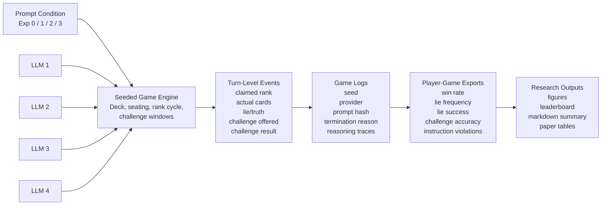
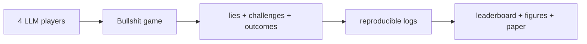

# Figure 1 Draft: Benchmark Overview

Use this file to build the first figure in the paper and a simplified variant for the blog post.

## Goal

Figure 1 should explain the benchmark in one glance:
- four LLMs play Bullshit
- deception is legal in some conditions
- opponents can challenge
- gameplay becomes logs
- logs become metrics, figures, and a leaderboard

It should communicate the benchmark pipeline, not just the UI.

## Recommended Caption

> **Figure 1: Bullshit-Bench overview.** Four LLM agents play seeded games of *Bullshit* under one of four prompt conditions. Each turn records the actual cards played, the public claim, whether the move was a lie, whether opponents were offered a challenge opportunity, and the outcome of any challenge. These provenance-aware game logs are then aggregated into player-game metrics, figures, and leaderboard summaries for deception, challenge behavior, moral restraint, and instruction compliance.

## Paper Version

Use this fuller mermaid diagram as the paper draft source.

## Blog / Portfolio Version

Use a simpler diagram or screenshot annotation:

## Figure Components

The ideal paper figure visually distinguishes:
- hidden private cards
- public claim
- challenge window
- logged metadata
- derived metrics

If you build this as a polished vector figure later, use color sparingly:
- one color for game state
- one color for logging/provenance
- one color for analysis outputs

## What To Avoid

- do not make Figure 1 a UI screenshot only
- do not overload it with every model name
- do not include quantitative findings here
- do not turn it into a low-level code architecture diagram

The purpose is conceptual orientation.

## Optional Subfigure Layout

If you want a 2-part figure:

- **Figure 1a:** benchmark flow diagram
- **Figure 1b:** screenshot of the visualizer or leaderboard

This works well for the blog post too.

## Assets To Capture Later

- one clean screenshot of a game in the visualizer
- one clean screenshot of the leaderboard/stats panel
- one exported chart from the final pilot

Use those only after the pilot is done and the final cohort is locked.
